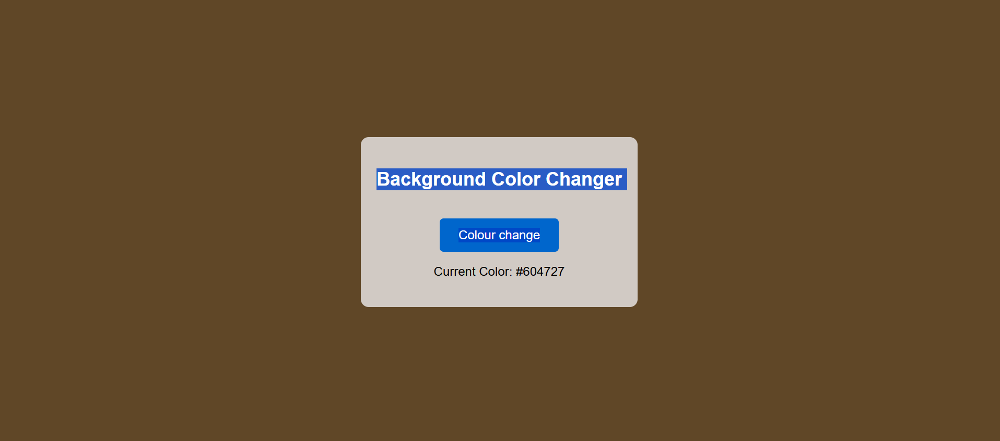

# Background Color Changer

This is a simple web application that allows users to change the background color of the webpage randomly with just a click of a button. The new color is displayed in HEX format.

---

##  Features
- Random background color generation
- Displays the current color’s HEX value
- Simple and responsive design
- Built with **HTML, CSS, and JavaScript**

---

##  Screenshot
## 📸 Screenshot

---

##  Tech Stack
- **HTML5**
- **CSS3**
- **JavaScript (Vanilla JS)**

---
